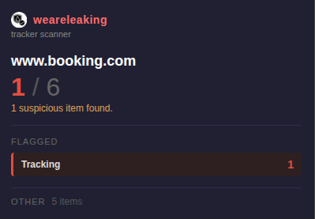

# weareleaking

> See what tracking data websites store in your browser.

weareleaking scans localStorage and sessionStorage on every website you visit and shows you what's being stored without your knowledge. It detects cross-site trackers, advertising networks, fingerprinting IDs, and exposed personal data — all using local pattern matching. Open the popup for a quick per-site verdict.

Everything runs in your browser. No data is collected, transmitted, or shared.

## What it detects
- **Cross-site tracking** — third-party systems following you across the web (`_ga`, `_fbp`, `segment`, `amplitude`, `hotjar`, etc.)
- **Advertising** — ad networks and retargeting (`gclid`, `fbclid`, `utm_*`, `doubleclick`, `criteo`, `taboola`)
- **Fingerprinting** — device and browser identification (`device_id`, `browser_id`, `visitor_id`, `fingerprint`)
- **PII exposure** — personal data sitting in storage (email addresses)
- **Tracking** — generic tracking identifiers (UUIDs in values)

## Try It Now

Store approval pending — install locally in under a minute:

### Chrome
1. Download this repo (Code → Download ZIP) and unzip
2. Go to `chrome://extensions` and turn on **Developer mode** (top right)
3. Click **Load unpacked** → select the `chrome-extension` folder
4. That's it — browse any site and click the extension icon

### Firefox
1. Download this repo (Code → Download ZIP) and unzip
2. Go to `about:debugging#/runtime/this-firefox`
3. Click **Load Temporary Add-on** → pick any file in the `firefox-extension` folder
4. That's it — browse any site and click the extension icon

> Firefox temporary add-ons reset when you close the browser — just re-load next session.

---

## The weare____ Suite

Privacy tools that show what's happening — no cloud, no accounts, nothing leaves your browser.

| Extension | What it exposes |
|-----------|----------------|
| [wearecooked](https://github.com/hamr0/wearecooked) | Cookies, tracking pixels, and beacons |
| [wearebaked](https://github.com/hamr0/wearebaked) | Network requests, third-party scripts, and data brokers |
| **weareleaking** | localStorage and sessionStorage tracking data |
| [wearelinked](https://github.com/hamr0/wearelinked) | Redirect chains and tracking parameters in links |
| [wearewatched](https://github.com/hamr0/wearewatched) | Browser fingerprinting and silent permission access |
| [weareplayed](https://github.com/hamr0/weareplayed) | Dark patterns: fake urgency, confirm-shaming, pre-checked boxes |
| [wearetosed](https://github.com/hamr0/wearetosed) | Toxic clauses in privacy policies and terms of service |
| [wearesilent](https://github.com/hamr0/wearesilent) | Form input exfiltration before you click submit |

All extensions run entirely on your device and work on Chrome and Firefox.
